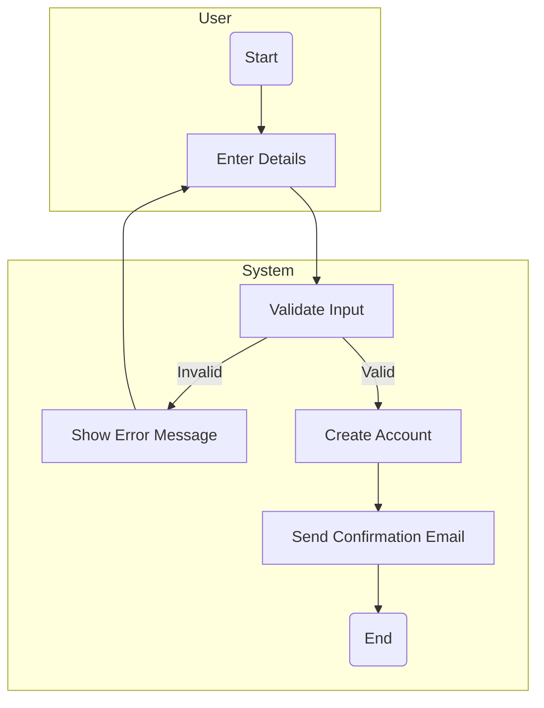
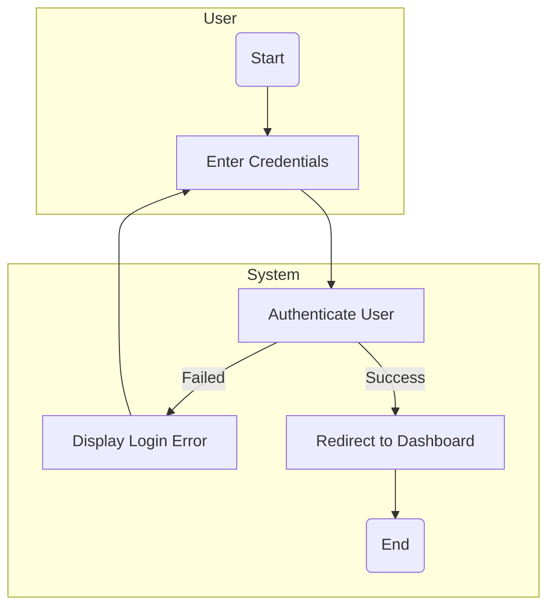
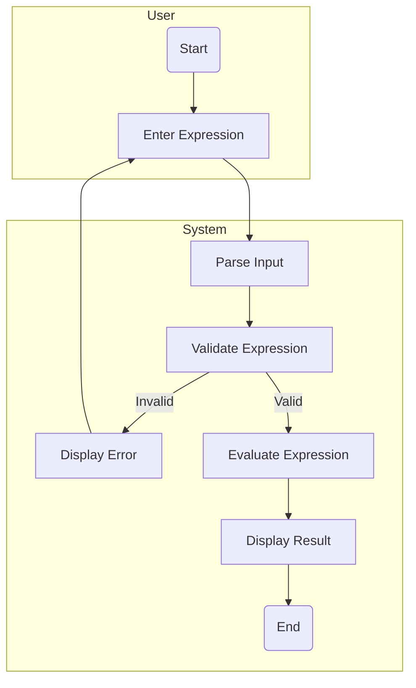
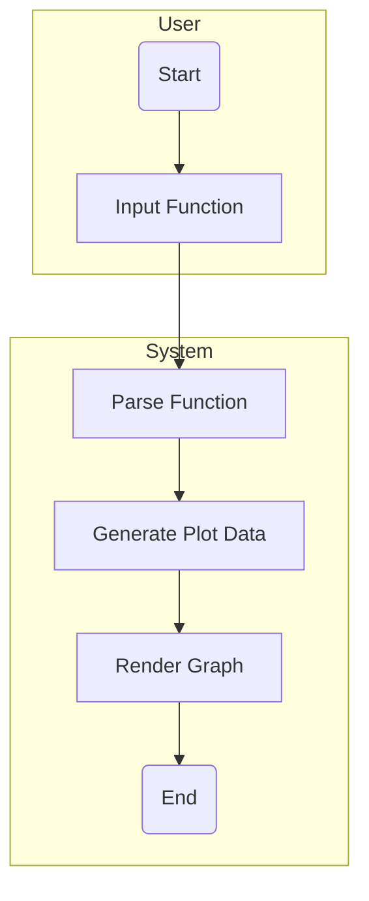
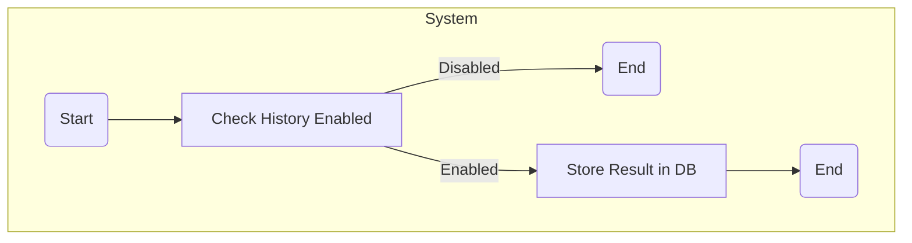
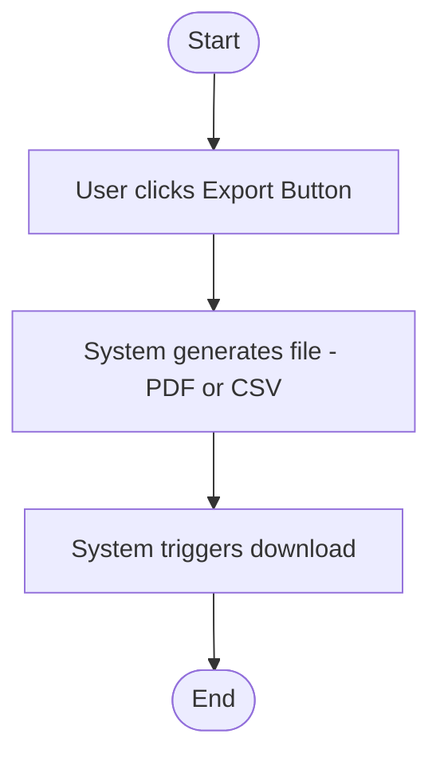
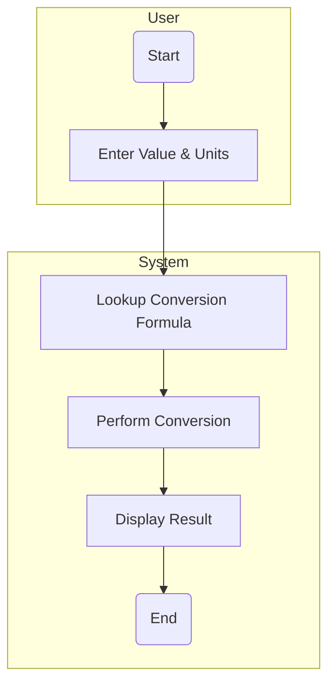
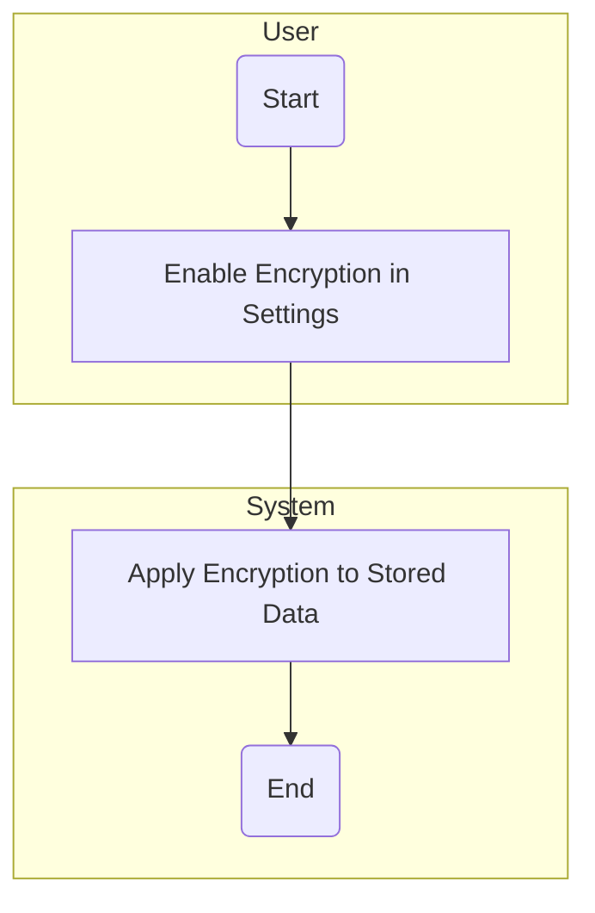

### Advanced Calculator System: Activity Diagrams & Explanations (GitHub-Ready Mermaid Format)
---

## 1. **User Registration Workflow**

**Explanation:**
- This workflow shows how users register.
- Decision node checks if input is valid.
- If valid, system proceeds with creation and email.
- Addresses stakeholder need for secure sign-up.
- Stakeholder Concern: Ensuring that user registrations are secure and validated.

How It Addresses the Concern: The system first validates the user's input, ensuring that only valid data is accepted. If the input is invalid, an error message is displayed, prompting the user to correct the details. Once the input is valid, the account is created, and a confirmation email is sent to the user. This addresses concerns regarding secure sign-up and proper validation of user information.

## 2. **Login Workflow**

**Explanation:**
- Shows how login is handled.
- Branching logic validates credentials.
- Addresses security concern from users.
- Stakeholder Concern: Ensuring that only authenticated users can access the system.

How It Addresses the Concern: The login process involves checking the user’s credentials. If the credentials are valid, the system grants access by redirecting the user to their dashboard. If the credentials are incorrect, an error is displayed, ensuring that unauthorized access is prevented. This addresses security concerns for both users and administrators.

---

## 3. **Perform Calculation**

**Explanation:**
- Core calculator logic.
- Ensures expressions are valid before evaluation.
- Functional link: FR-001 (Basic Calculations).
-Stakeholder Concern: Ensuring that the calculator performs accurate and error-free calculations.

How It Addresses the Concern: The system first parses and validates the user’s input. If the expression is invalid, an error message is displayed, prompting the user to enter a valid expression. If the input is valid, the expression is evaluated, and the result is displayed. This ensures that the calculator performs accurate calculations and handles errors effectively, meeting the functional requirements for basic calculations.
---

## 4. **Graphing Calculator Workflow**

**Explanation:**
- Visualizes the advanced graphing feature.
- Related to US-004 (Graphing).
- Stakeholder Concern: Providing an advanced graphing feature for users.

How It Addresses the Concern: This workflow demonstrates how the graphing feature works. The user inputs a mathematical function, which is then parsed and used to generate plot data. The system then renders the graph, providing a visual representation of the function. This workflow fulfills the need for advanced features like graphing, which appeals to users needing visualizations in their calculations.

---

## 5. **Save Calculation History**

**Explanation:**
- Stores user calculations if enabled.
- Addresses FR-003 (History Logging).
- Stakeholder Concern: Providing users with a way to track their past calculations.

How It Addresses the Concern: If the user has enabled history logging, the system will store the result of each calculation in a database, allowing the user to review their past calculations. If history logging is disabled, the process ends without storing any data. This addresses the need for users to have a record of their past calculations, enhancing usability.

---

## 6. **Export History Workflow**

**Explanation:**
- Enables data portability.
- Fulfills FR-008 (Export History).
- Stakeholder Concern: Allowing users to export their calculation history for offline use.

How It Addresses the Concern: This workflow enables the user to export their calculation history in a format such as PDF or CSV. The system generates the file and triggers the download, ensuring users can keep records of their calculations. This feature addresses the need for portability and usability, particularly for users who want to keep a history of their work for future reference.

---

## 7. **Unit Conversion Workflow**

**Explanation:**
- Provides a unit converter.
- Functional mapping to US-005.
- Stakeholder Concern: Providing users with a way to convert units easily.

How It Addresses the Concern: The system allows users to enter a value and specify the units they want to convert. It then looks up the appropriate conversion formula and performs the conversion, displaying the result. This workflow addresses the need for a simple and accurate unit conversion tool, ensuring that users can easily convert values across various units.

---

## 8. **Encryption Option Workflow**

**Explanation:**
- Secures user data.
- Matches US-009 (Data Encryption).
- Stakeholder Concern: Ensuring user data is secure and encrypted.

How It Addresses the Concern: This workflow addresses data security by allowing users to enable encryption through the settings. Once enabled, the system encrypts any stored data, ensuring it is protected from unauthorized access. This feature enhances user trust and ensures compliance with security best practices.

---

