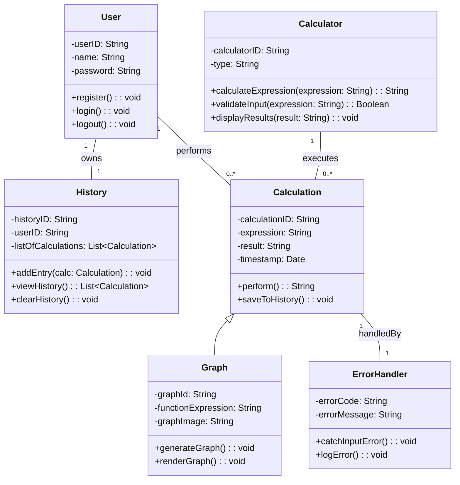

---

## Updated Class Diagram
```mermaid
classDiagram

    %% ====== Core Models ======
    class User {
        -userID: String
        -name: String
        -password: String
        +register(): void
        +login(): void
        +logout(): void
    }

    class Calculator {
        -calculatorID: String
        -type: String
        +calculateExpression(expression: String): String
        +validateInput(expression: String): Boolean
        +displayResults(result: String): void
    }

    class Calculation {
        -calculationID: String
        -expression: String
        -result: String
        -timestamp: Date
        +perform(): String
        +saveToHistory(): void
    }

    class Graph {
        -graphId: String
        -functionExpression: String
        -graphImage: String
        +generateGraph(): void
        +renderGraph(): void
    }

    class History {
        -historyID: String
        -userID: String
        -listOfCalculations: List~Calculation~
        +addEntry(calc: Calculation): void
        +viewHistory(): List~Calculation~
        +clearHistory(): void
    }

    class ErrorHandler {
        -errorCode: String
        -errorMessage: String
        +catchInputError(): void
        +logError(): void
    }

    %% ====== Repository Layer ======
    class Repository~T, ID~ {
        <<interface>>
        +save(entity: T): void
        +findById(id: ID): T
        +findAll(): List~T~
        +delete(id: ID): void
    }

    class UserRepository {
        <<interface>>
    }

    class InMemoryUserRepository {
    }

    class FileSystemUserRepository {
    }

    %% ====== Relationships ======
    User "1" -- "1" History : owns
    User "1" -- "0..*" Calculation : performs
    Calculator "1" -- "0..*" Calculation : executes
    Calculation <|-- Graph
    Calculation "1" -- "1" ErrorHandler : handledBy

    %% ====== Repository Relationships ======
    Repository~User, String~ <|-- UserRepository
    UserRepository <|-- InMemoryUserRepository
    UserRepository <|-- FileSystemUserRepository
    User "1" --> "1" UserRepository : persists via

