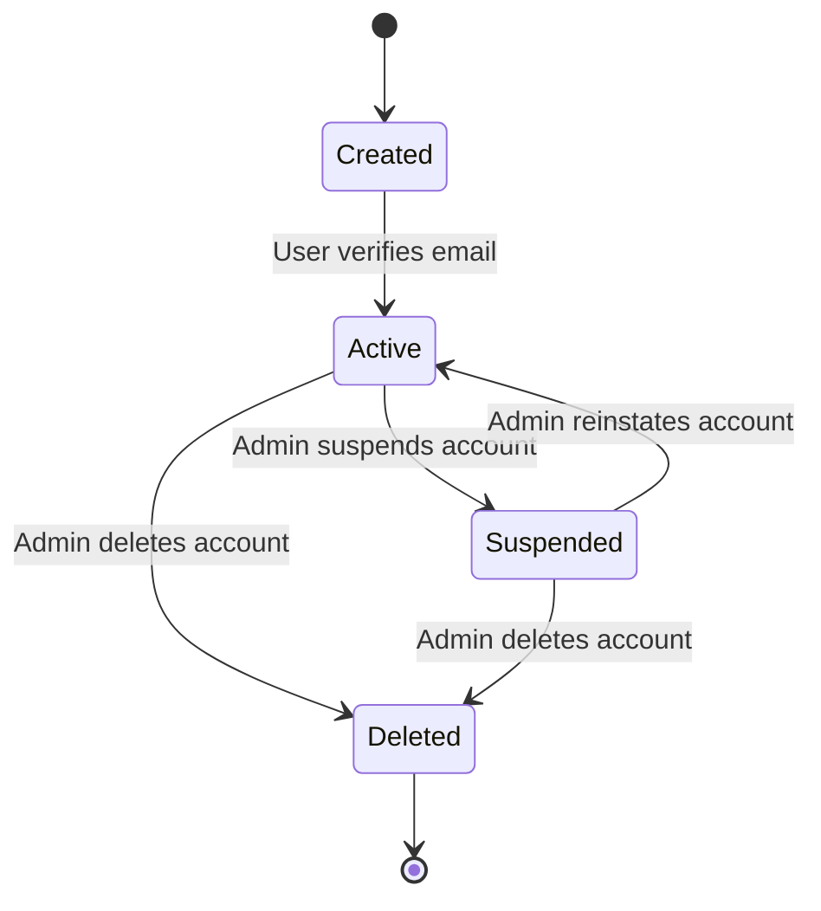
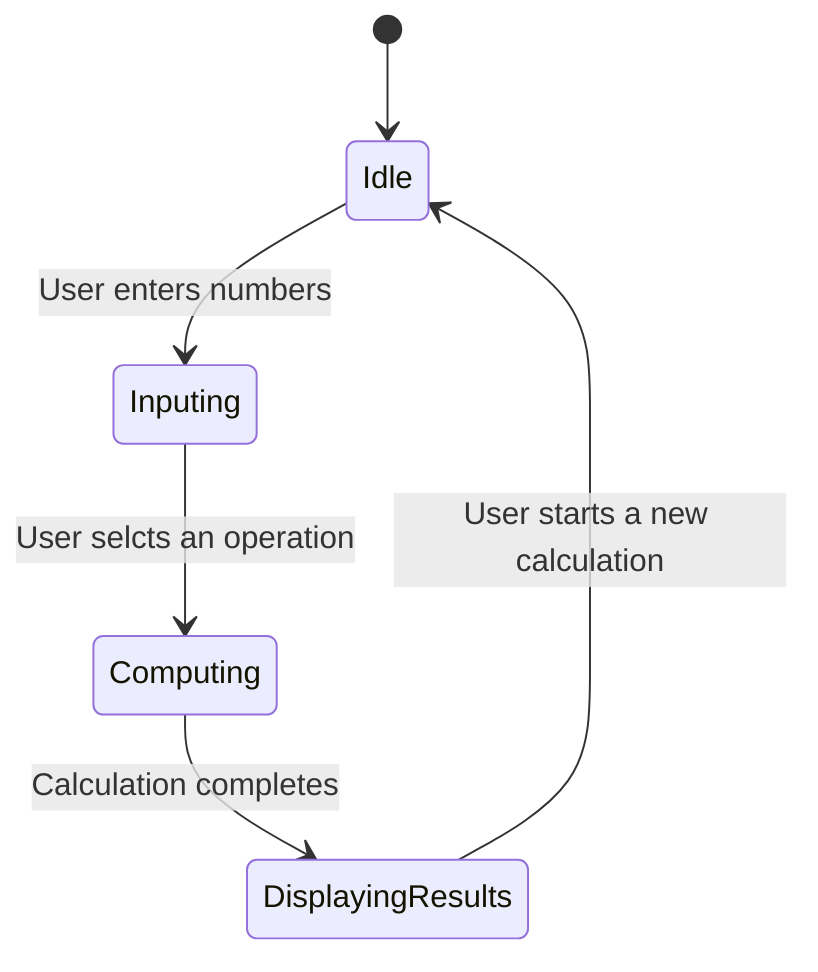
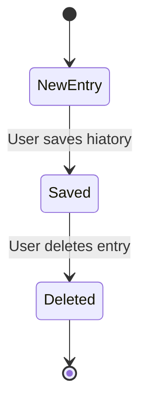
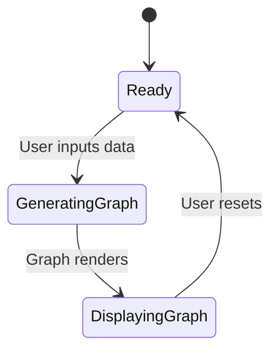
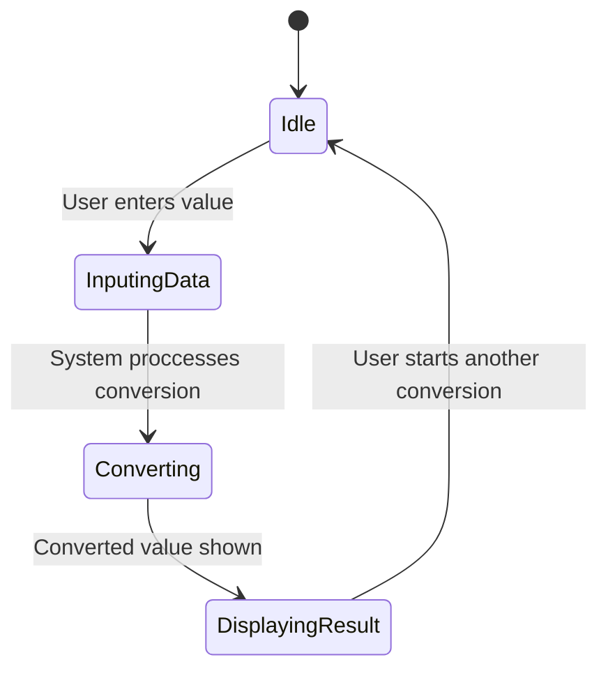
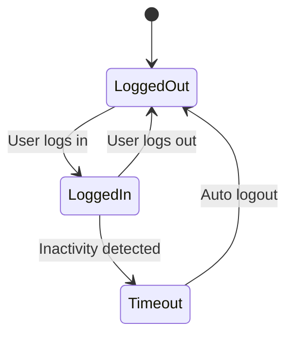
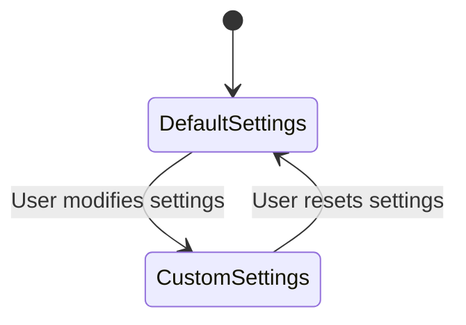

# State Transition Diagrams for Calculator System

## 1.User Account

### Explanation
The user account starts in the Created sate when a user registers.

It transition to Active once the email is verified.

If the user violates the terms, the account can be suspended.

Suspended acounts can be restored by an admin.

Users can permanently delete their accounts.

### Mapping to Functional Requirements
Dleted states maps to FR-003: Allow users to delete their accounts.

Suspended states maps to FR-007: Admin can suspend accounts for violations.

## 2.Calculation Process

### Explanation 
The system waits in Idle unti the usr provides input.

Moves to Computing once an operation is selected.

Displayingesults shows the answer before returning to Idle.

### Mapping to Functional Requirements.
Computing states maps to FR-010: Perform calculations efficiently.

## 3. History Recorded

### Explanation
Each calculation starts in NewEntry.
It is Saved if the user chooses to keep history.
Users can Delete records anytime.

### Mapping to Functional Requirements
Saved states maps to FR-015: Allow users to save calculations.

## Graphing Function

### Explanation
The system is Ready before a graph is requested.

Moves to GenratingGraph when the data is procesed.

The graph appears in DisplayingGraph.

### Mapping to Functional Requirements
GeneratingGraph maps to FR-020: Provide graphing capabilities.

## Unit Conversion

### Explanation
Similar to the calculator , this process follows input to process to output.

### Mapping to Functional Requirements
Converting state maps to FR-025: Enable unit conversions.

## Session Manangement

### Explanation
The system logs out users after inactivity( Timeout).

Users can manually log out anytime.

### Mapping of Functional Requirements
Timeout state maps to FR-030: Auto-logout after inactivity.

## Setting Configuaration

### Explanation
Settings start in DefualtSettings.

Users can Customize, then Reset.

### Mapping of Functional Requirements
CustomSetting stste maps to FR-035: Allow users to personalize settings.
