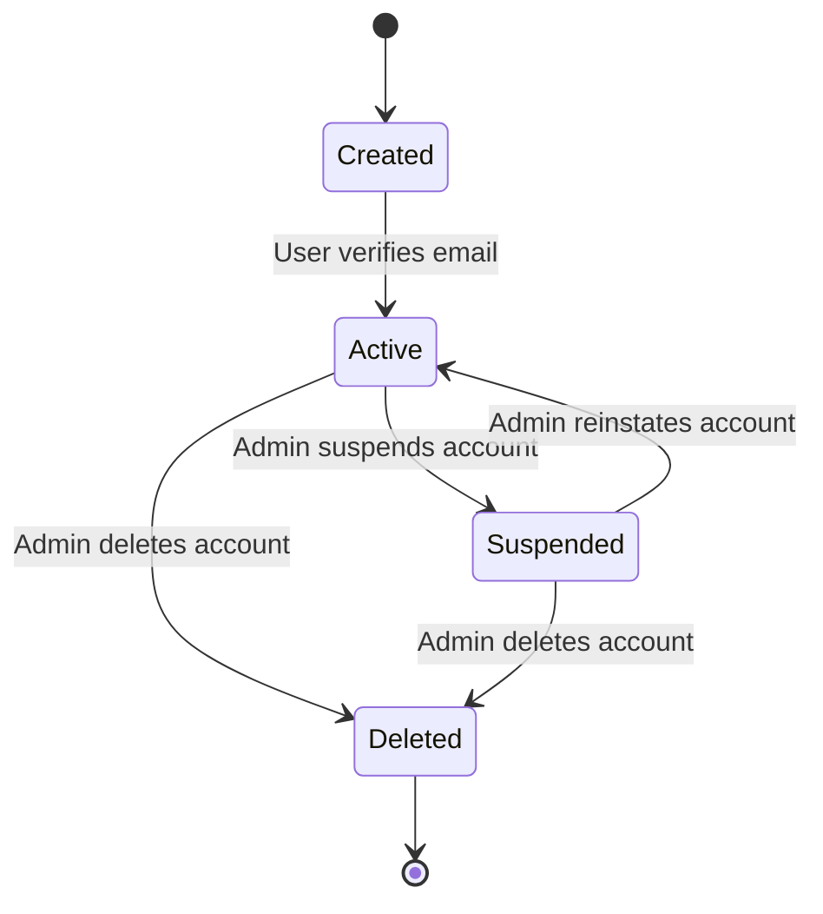
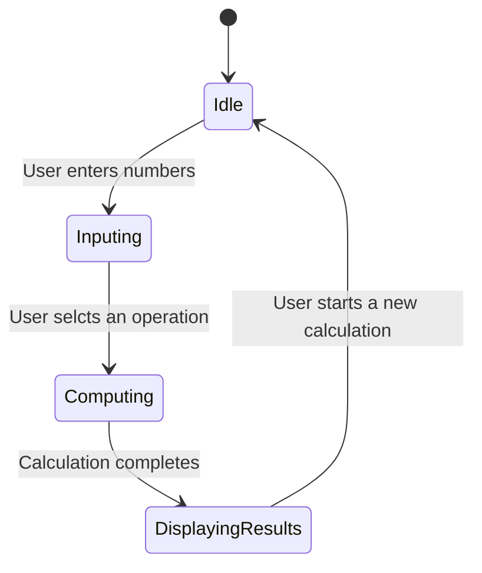
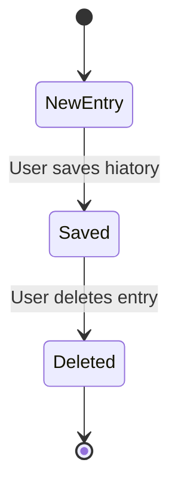

# State Transition Diagrams for Calculator System

## 1.User Account

### Explanation
The user account starts in the Created sate when a user registers.
It transition to Active once the email is verified.
If the user violates the terms, the account can be suspended.
Suspended acounts can be restored by an admin.
Users can permanently delete their accounts.

### Mapping to Functional Requirements
Dleted states maps to FR-003: Allow users to delete their accounts.
Suspended states maps to FR-007: Admin can suspend accounts for violations.

## 2.Calculation Process

### Explanation 
The system waits in Idle unti the usr provides input.
Moves to Computing once an operation is selected.
Displayingesults shows the answer before returning to Idle.

### Mapping to Functional Requirements.
Computing states maps to FR-010: Perform calculations efficiently.

### Explanation
Each calculation starts in NewEntry.
It is Saved if the user chooses to keep history.
Users can Delete records anytime.

### Mapping to Functional Requirements
