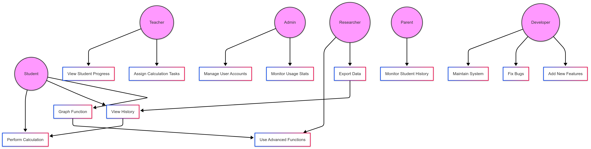

# Calculator System Use Cases

## Overview

The Calculator System is a web-based application that provides basic and advanced mathematical operations, unit conversions, and other utilities for users. It includes functionality to view calculation history, graph functions, and export data, making it useful for students, teachers, researchers, and developers.

## Actors

1. **Student**: A primary user who interacts with the basic and advanced calculator functions.
2. **Teacher**: An educator who uses the system to perform calculations and track student progress.
3. **Admin**: A system administrator responsible for managing user accounts and monitoring usage stats.
4. **Researcher**: A user who needs advanced functions for data analysis and exports calculation history.
5. **Parent**: A user (typically a guardian) who monitors the calculation history of their child/student.
6. **Developer**: A person responsible for system maintenance, bug fixes, and feature additions.

## Use Cases

### **Use Case 1: Perform Calculation**
- **Actor(s):** Student, Teacher, Admin, Researcher, Parent, Developer
- **Description:** Allows users to perform basic and advanced mathematical operations.
- **Preconditions:** User has entered valid input.
- **Postconditions:** The result of the calculation is displayed.
- **Basic Flow:**
  1. User enters numbers and selects an operation.
  2. System processes the calculation.
  3. System displays the result.
- **Alternative Flow:**
  - If invalid input is entered, the system displays an error message.

### **Use Case 2: View Calculation History**
- **Actor(s):** Student, Teacher
- **Description:** Allows users to view past calculations.
- **Preconditions:** User has previously performed calculations.
- **Postconditions:** Past calculations are displayed.
- **Basic Flow:**
  1. User navigates to the history section.
  2. System retrieves and displays stored calculations.
- **Alternative Flow:**
  - If no history exists, the system informs the user.

### **Use Case 3: Clear Calculation History**
- **Actor(s):** Student, Teacher, Admin
- **Description:** Allows users to delete stored calculations.
- **Preconditions:** Calculation history exists.
- **Postconditions:** History is cleared.
- **Basic Flow:**
  1. User selects the clear history option.
  2. System deletes stored calculations.
  3. System confirms deletion.
- **Alternative Flow:**
  - If history is already empty, the system notifies the user.

### **Use Case 4: Graph a Mathematical Function**
- **Actor(s):** Student, Teacher, Researcher
- **Description:** Users can input a function and view a graph.
- **Preconditions:** User enters a valid function.
- **Postconditions:** Graph is displayed.
- **Basic Flow:**
  1. User enters a function.
  2. System processes and generates the graph.
  3. System displays the graph.
- **Alternative Flow:**
  - If input is invalid, system prompts for correction.

### **Use Case 5: Perform Unit Conversion**
- **Actor(s):** Student, Teacher, Admin
- **Description:** Allows users to convert between different measurement units.
- **Preconditions:** User selects valid units and enters a value.
- **Postconditions:** Converted value is displayed.
- **Basic Flow:**
  1. User selects units and enters a value.
  2. System processes the conversion.
  3. System displays the converted value.
- **Alternative Flow:**
  - If invalid units are selected, the system displays an error.

### **Use Case 6: Access Advanced Functions**
- **Actor(s):** Student, Teacher, Researcher
- **Description:** Allows users to access advanced operations like logarithms and trigonometry.
- **Preconditions:** User selects an advanced function.
- **Postconditions:** System calculates and displays the result.
- **Basic Flow:**
  1. User selects an advanced function.
  2. System processes the calculation.
  3. System displays the result.
- **Alternative Flow:**
  - If input is invalid, system prompts the user to enter a valid input.

### **Use Case 7: Save Favorite Calculations**
- **Actor(s):** Student, Teacher
- **Description:** Users can save frequently used calculations for quick access.
- **Preconditions:** User has performed a calculation.
- **Postconditions:** Calculation is stored under favorites.
- **Basic Flow:**
  1. User selects "Save to Favorites."
  2. System saves the calculation.
  3. System confirms the action.
- **Alternative Flow:**
  - If memory is full, system informs the user.

### **Use Case 8: Export Calculation History**
- **Actor(s):** Student, Teacher, Admin, Researcher, Developer
- **Description:** Users can export their calculation history as a file.
- **Preconditions:** User has history data.
- **Postconditions:** History is exported as a file.
- **Basic Flow:**
  1. User selects the export option.
  2. System generates a file with past calculations.
  3. System prompts the user to download.
- **Alternative Flow:**
  - If no history exists, system notifies the user.

## UML Diagram

A **Use Case Diagram** for this Calculator System is provided below. It shows the interactions between the actors and the system’s functionalities.

